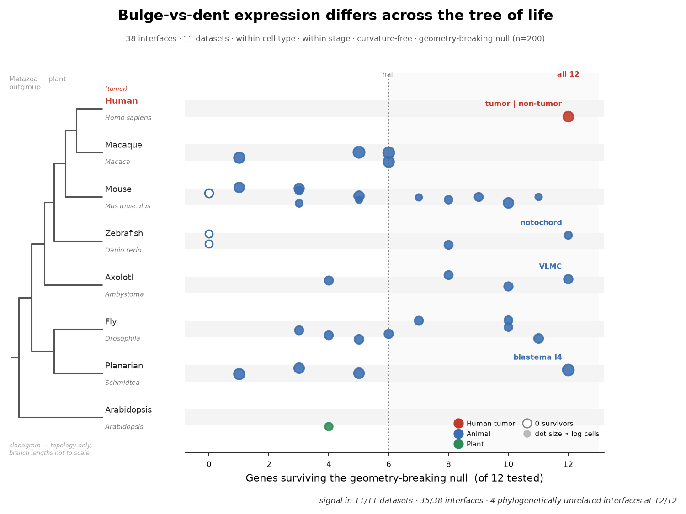
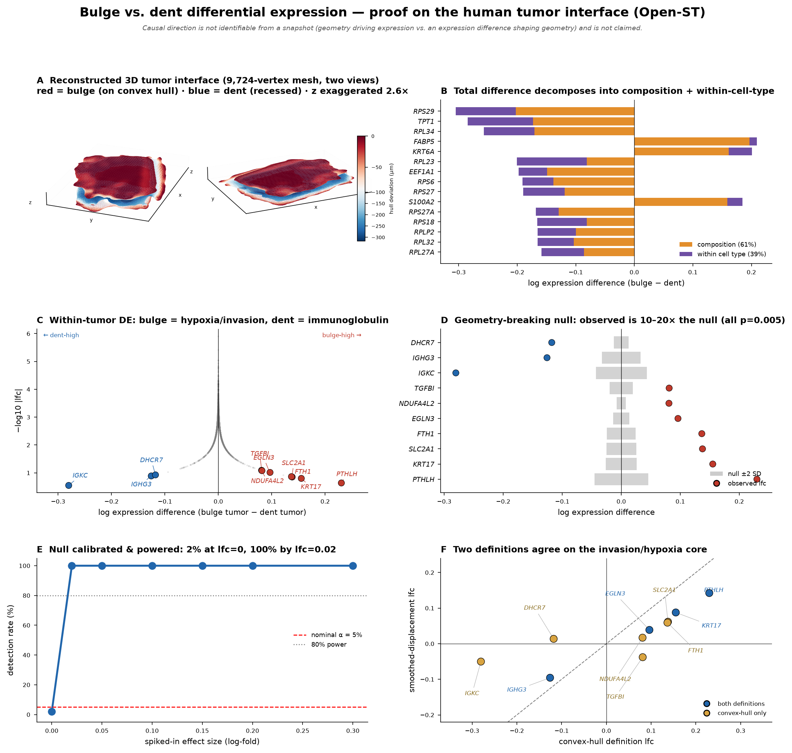
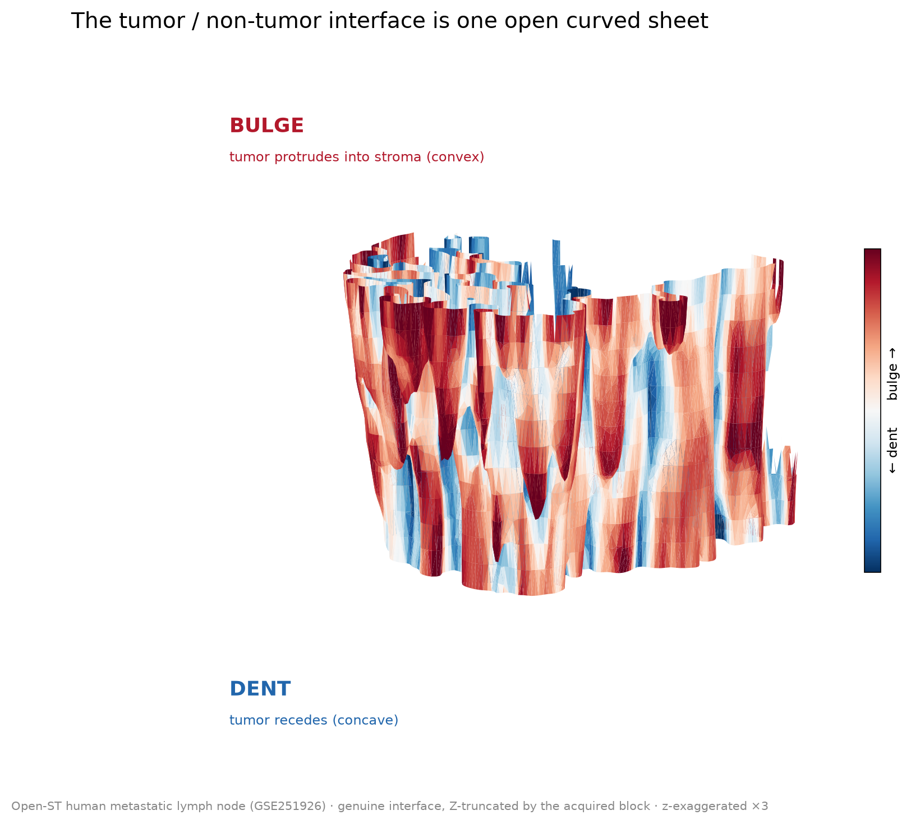

# morphoDE — Bulge vs. Dent: a cross-species test of interface geometry → gene expression

*morphoDE = **morpho**logy × **d**ifferential **e**xpression: does the shape of a cell-type interface (its bulges and dents) correspond to a difference in gene expression?*

**Do the convex ("bulge") and concave ("dent") parts of a cell-type interface
express different genes?** We tested this deliberately naive hypothesis across
**11 spatial-transcriptomics datasets and 126 interface–strata**, from a human
tumor to a plant leaf, and found the correspondence holds almost everywhere — it
is a general property of tissue architecture, not a tumor-specific phenomenon,
and it is reproducible across developmental stages, regeneration time points, and
individual specimens of the same organism.

> Built with **Claude Science** for the 2026 *Built with Claude: Life Sciences*
> hackathon (Researcher Track). The biological question and the public datasets
> predate the event; **the analysis in this repository was carried out during the
> hackathon.**



*Each dot is one interface–stratum: the number of top differential-expression
genes (out of 12) whose bulge-vs-dent signal survives a geometry-breaking null.
Rows are ordered phylogenetically (vertebrates → invertebrates → plant). Red =
human tumor, blue = animal, green = plant; short vertical line = per-species
median; hollow = zero survivors. Signal is present across the whole tree of life.*

---

## The headline result

| Metric | Value |
|---|---|
| Datasets tested | **11** |
| Interface–strata tested | **126** |
| Datasets with ≥1 interface carrying signal | **11 / 11** |
| Interface–strata with ≥1 surviving gene | **125 / 126** |
| Interface–strata with ≥6/12 surviving | **97** |
| Interface–strata at a perfect 12/12 | **16** |
| Interface–strata with zero survivors | **1** |

Species/organs spanned: **human** (HNSCC metastatic lymph node, Open-ST),
**macaque** (cerebellum), **axolotl** (regenerating brain), **zebrafish**
(embryo), **mouse** (three independent embryo atlases), **fly** (larva + pupa,
Stereo-seq), **planarian** (regeneration), and **Arabidopsis** (leaf).

An **interface–stratum** is one cell-type interface measured within one
developmental stage / regeneration time point / specimen. Multi-stage or
multi-specimen datasets contribute one row per stratum, so the same interface is
tested repeatedly across biological conditions — signal that holds across all of
them is far stronger evidence than a single snapshot. The single zero-survivor
(mouse digital-embryo *Paraxial mesoderm*, one specimen) is the null *working*:
its expression differences track another spatial axis, not the bulge/dent
geometry, so the geometry-breaking null correctly rejects it.

---

## Why this is not trivial (the design that makes the result trustworthy)

A naive bulge-vs-dent comparison is dominated by three confounds. Each is
removed by construction:

1. **Cell-type composition.** Bulges and dents contain different cell types.
   → We measure differential expression **within a single cell type**, and
   separately decompose the total difference into a composition term and a
   within-cell-type term (Kitagawa/Oaxaca-style). On the human tumor's genuine
   interface the split is **93 % within-cell-type / 7 % composition** — the
   bulge/dent difference is overwhelmingly a change in what a single tumor cell
   type expresses, not a reshuffling of cell types.

2. **Spatial autocorrelation & "it's just a different location".** Neighboring
   cells are similar, so any two regions differ. The standard fix — a
   spatial-autoregressive (SAR/GM_Lag) model — **is the wrong test here**: if
   geometry drives expression, that effect is itself spatially smooth and nearly
   collinear with the SAR lag term, so SAR absorbs it and reports
   non-significance. We instead use a **geometry-breaking null**: per-section
   azimuthal circular shift of the bulge/dent score. This preserves spatial
   smoothness but destroys the score↔position correspondence, asking exactly the
   right question — *"is the geometry-label ↔ expression correspondence stronger
   than a spatially-smooth random relabeling?"*

3. **Developmental stage / specimen (atlases only).** In a multi-stage atlas the
   interface geometry partly tracks stage/body size. → We analyze **each stage /
   specimen as its own interface–stratum** and report all of them, so a claim only
   stands if it holds across biological conditions, not because we cherry-picked a
   stratum.

The null is validated two ways on the human tumor (panel E of the proof figure):
**false-positive rate is nominal** (p<0.05 in ~5 % when expression carries no true
geometric signal) and **power is 100 % at log-fold 0.02** — far below the observed
effect sizes.

**The interface is an open surface, not a closed solid.** An earlier version used
the convex hull of the domain, which closes the tissue block into a solid and
mislabels the physical cut-faces of the acquired slab as "bulges." We now extract
the **genuine open interface sheet** — keeping only surface faces that have
sampled tissue on *both* sides (the real domain/non-domain boundary), which
discards the block's cut-faces. The sheet's voxel resolution is **density-adaptive**
(sized to the local cell density, no per-dataset hand-tuning). Bulge/dent are the
**normal displacement** of this open sheet; a second **mean-curvature** definition
agrees gene-for-gene (ρ≈0.86, 12/12 same sign). The sign is fixed to the physical
surface orientation: **positive = convex = the domain protrudes into its neighbor
(bulge)**, negative = concave = the domain recedes (dent).

**Causal direction is not identifiable** from a single-time-point snapshot and is
never claimed. We show only that a bulge/dent ↔ expression correspondence
survives after removing composition, spatial structure, location, and stage.



*The full evidence on the human tumor (Open-ST). **A** the genuine open interface
sheet from two angles (red = bulge/convex, blue = dent/concave). **B** the
bulge–dent difference is 93 % within cell type, only 7 % composition. **C**
within-tumor DE: bulge/convex = IGKC·IGHG3·DHCR7 (immunoglobulin / cholesterol),
dent/concave = PTHLH·KRT17·FTH1 (hypoxia / invasion / keratinization). **D** all
12 genes clear the geometry-breaking null (colored = observed, grey = null). **E**
false-positive rate is nominal and power reaches 100 % by log-fold 0.02. **F** the
primary (normal-displacement) definition and a mean-curvature cross-check agree
gene-for-gene (ρ≈0.86).*

The interface itself — one open curved sheet, Z-truncated by the acquired tissue
block, not a closed solid:



---

## What Claude Science did here

- **Reframed a failing analysis.** The continuous-curvature → expression analysis
  collapsed under SAR. Claude diagnosed *why* (SAR is unfair to a smooth
  geometric effect) and replaced it with the geometry-breaking null that puts the
  hypothesis on trial correctly.
- **Caught and fixed a structural flaw mid-project.** The reviewer (the user)
  noticed the human-tumor interface was being rendered as a closed blob when the
  tissue was never acquired as a closed solid. Claude verified the problem
  quantitatively (bulge cells' 60 µm neighborhoods were only ~4 % non-tumor — they
  faced *unsampled space*, not the real boundary), rebuilt the method on the
  genuine open interface sheet, and re-ran all 126 interface–strata. The
  headline finding survived and sharpened (within-cell-type share 39 % → 93 %).
- **Verified the geometry sign against data, not intuition.** When a red/blue
  color looked backwards, Claude did not guess — it probed the sheet normal
  (tumor-fraction 0.62 vs 0.33 across the surface) to fix the bulge/dent sign from
  the physical surface orientation alone, then reported whatever biology followed.
- **Fanned the analysis across 11 datasets** as independent parallel sub-agents
  (fresh kernels), each handling one dataset's interface extraction, stratum
  detection, within-cell-type DE, and null test.
- **Packaged the method as a reusable skill** (`skill/interface-bulge-dent-de`)
  with a `kernel.py` of tested helpers, so the whole pipeline runs on a new
  dataset in one call.

---

## Reproducing

Everything below runs from this repository. The pipeline is:

```
data/catalog.csv  ─ scripts/download.py ─→  <dataset>/*.h5ad
        │                                          │
        │  data/recipes.csv (which interface,      │
        │  which stratum, per dataset)             ▼
        └──────────────→  scripts/reproduce.py  ──→  results/<dataset>_bd.csv
                              │  loads via src/st3d_loader.py + src/st3d_adapters.py
                              │  runs the method in src/open_interface.py
```

### 1. Environment

```bash
conda env create -f environment.yml     # creates env `morphode` (Python 3.11)
conda activate morphode
# — or, with pip on an existing Python 3.11 —
pip install -r requirements.txt
```

The method itself is three functions in `src/open_interface.py`; the loaders and
recipes wire the 11 public datasets into them:

```
src/open_interface.py    extract_open_interface → band_scores → de_and_null
src/st3d_loader.py       generic serial-section → 3-D point-cloud assembler
src/st3d_adapters.py     per-dataset load adapters (format/annotation quirks)
scripts/reproduce.py     catalog + recipes driven end-to-end runner
data/recipes.csv         126 interface–strata: domain, stratum, loader per dataset
skill/interface-bulge-dent-de/kernel.py   scoring/decomposition helpers
src/legacy_closed_mesh/  the superseded closed-hull driver (provenance)
```

### 2. Get the data

Raw `.h5ad` files are **not** redistributed here (size + upstream licensing), but
the data layer is reproducible from the catalog:

```bash
python3 scripts/download.py --list                 # catalog + access class
python3 scripts/download.py acsta_arabidopsis       # one dataset (small, ~80 MB)
python3 scripts/download.py --all                   # every auto-downloadable set
```

Datasets download as plain `.h5ad` under `data/<dataset_id>/`. Nine of the eleven
are auto-downloadable (GEO / CNGB); two are portal/controlled and the downloader
prints their accession + portal and stops. See [`DATA.md`](DATA.md) for the full
source table and the two manual datasets.

### 3. Run the method end to end

```bash
python3 scripts/reproduce.py --list                 # 126 interface–strata, 11 datasets
python3 scripts/reproduce.py --smoke                 # fast E2E check (1 light dataset)
python3 scripts/reproduce.py --dataset acsta_arabidopsis --check
python3 scripts/reproduce.py --all --check           # every dataset; compare to headline
```

`reproduce.py` loads each dataset, and for every `(domain, stratum)` in
`data/recipes.csv` extracts the open interface, scores bulge/dent, runs the
within-cell-type DE + geometry-breaking null, and writes `results/<dataset>_bd.csv`.
If your `.h5ad` live in a cache rather than `data/`, point the runner at it:

```bash
python3 scripts/reproduce.py --dataset zesta_zebrafish --data-root /path/to/cache
```

A captured run is in [`results/smoke_test.log`](results/smoke_test.log).

### What "reproducible" means here — verified

- **The published answers ship with the repo** and are the reference:
  [`results/bd_final_headline.csv`](results/bd_final_headline.csv) (126 rows) and
  `results/bd_final_full.json` (per-interface gene lists, log-folds, null p-values).
  `data/recipes.csv` carries each row's published survivor count, so
  `reproduce.py --check` prints the fresh count beside the headline.
- **`reproduce.py` re-derives the headline survivor counts.** Running all eleven
  datasets end-to-end and comparing each interface-stratum's fresh survivor count
  to the published number, **125 of the 126 counts reproduce exactly**. (This is a
  reproducibility figure — how many per-interface counts the script regenerates —
  and is unrelated to the *scientific* "125/126 interface–strata with ≥1 surviving
  gene" above; the two numbers coincide by chance.) Per dataset:

  | dataset | exact / tested | | dataset | exact / tested |
  |---|---|---|---|---|
  | acsta_arabidopsis | **1 / 1** | | flysta3d_v2_drosophila | **4 / 4** |
  | openst_lymphnode_3d | **1 / 1** | | whole_mouse_embryo_3d_cngb | **4 / 4** |
  | digital_mouse_embryo_seu3d | **20 / 20** | | cerebellum_crossspecies_spatial | **4 / 4** |
  | prista4d_planarian | **47 / 47** | | mosta_mouse_embryo | **4 / 4** |
  | artista_axolotl_brain | **20 / 20** | | flysta3d_drosophila | **17 / 17** |
  | | | | zesta_zebrafish | 3 / 4 |

  The full comparison is in
  [`results/reproduction_check.csv`](results/reproduction_check.csv) (fresh count,
  published count, `n_band`, `genuine_frac`, match flag per row).
- **The geometry is exact.** Interface band-cell counts (`n_band`) and the
  genuine-open-surface fraction match the published values across datasets
  (e.g. acsta 2106, openst 98822, cerebellum molecular-layer 1 412 160, mosta
  per-domain `n_band` to the cell), confirming the coordinate assembly and mesh
  extraction re-derive the published interface.
- **The single non-match is a corrected normalization.** The
  zesta Segmental-Plate interface gives 8/12 here vs the published 10/12. The
  published run fed this interface through the DE step with `is_raw=True`, which
  applies a library-size + log1p normalization — but the zesta matrix is *already*
  log-normalized (max ≈ 7, non-integer values, raw counts kept in a separate
  `counts` layer), so that step double-normalized it. `reproduce.py` normalizes
  only matrices that are actually raw counts (acsta, whole_mouse, cerebellum,
  prista4d), and leaves zesta's already-log matrix untouched. This is the only
  place the fresh count departs from the headline; the other three zesta interfaces
  (Notochord 11/12, Nervous System 11/12, Yolk Syncytial Layer 12/12) are
  unaffected and match exactly. Treat the shipped `bd_final_*` tables as the
  published answer of record; `reproduce.py` reproduces them exactly everywhere
  except this one value, where it avoids the double normalization.
- **Faithful loading is per-dataset.** Reproducing the numbers requires each
  dataset's published assembly (which specimen a `stratum='all'` row uses, whether
  serial sections are rigidly registered, how z is assigned, the normalization
  state). `reproduce.py` encodes these per dataset (`data/recipes.csv` + the
  bespoke loaders in the runner); `--check` reports the match for each.

**Inputs the method needs per dataset:** per-cell 3-D coordinates, a per-cell
domain / non-domain label (the interface is extracted *from the points* — no
pre-built mesh), per-cell cell-type annotations, per-cell section id, and an
expression matrix (`reproduce.py` log-normalizes raw counts automatically).

Minimal direct usage of the method:

```python
from open_interface import extract_open_interface, band_scores, de_and_null
# XYZ: (n,3) coords; is_domain: (n,) bool; genes/section/Xn per cell
V, F, genuine_frac = extract_open_interface(XYZ, is_domain)         # open sheet
band, score, in_band = band_scores(XYZ, is_domain, V, F)            # bulge/dent
res = de_and_null(Xn[band], genes, score, XYZ[band], section[band]) # DE + null
# res: n_survive / n_tested, obs_lfc, pval, max_abs_lfc, top genes
```

---

## Results in this repo

| Path | Contents |
|---|---|
| `results/bd_final_headline.csv` | **Primary result:** per-interface–stratum survivors / tested / band cells / genuine-fraction — 126 rows (open-surface method) |
| `results/bd_final_full.json` | Per-interface–stratum gene list, log-fold, and null p-value for the 12 tested genes each |
| `results/legacy_closed_mesh/` | The earlier closed-convex-hull results (38 interfaces) kept for provenance — **superseded**; see the method note in `DATA.md` |
| `report/` | Full write-up (Japanese original + English translation) |

`bd_final_headline.csv` / `bd_final_full.json` are the results the paper and
figures are built on. The `legacy_closed_mesh/` tables reproduce the earlier
closed-surface analysis and are retained only so the correction is auditable.

---

## Figures

- `crossspecies_tree_of_life.png` — the cross-species headline (above): every
  interface–stratum plotted by phylogeny, so the breadth across the tree of life
  is read directly.
- `tumor_interface_proof.png` — six-panel proof on the human tumor: (A) the
  genuine **open** interface sheet from two angles, colored bulge→dent;
  (B) composition decomposition (93 % within cell type); (C) within-tumor DE
  (bulge/convex = IGKC·IGHG3·DHCR7 immunoglobulin/cholesterol; dent/concave =
  PTHLH·KRT17·FTH1 hypoxia/invasion/keratinization); (D) geometry-breaking null,
  12/12; (E) power curve; (F) the two shape definitions — normal displacement and
  mean curvature — agree gene-for-gene (ρ≈0.86).
- `concept_3d_still.png` / `concept_3d_rotate.mp4` — the interface as one open
  curved sheet, Z-truncated by the acquired block (demo hook).

All figure labels are in English. The proof figure is self-contained; earlier
standalone panels (`convexity_definitions.png`, `null_calibration_power.png`,
`de_decomposition.png`) were folded into it.

---

## License

MIT — see [`LICENSE`](LICENSE). Applies to the code, skill, and derived result
tables/figures in this repository. Underlying raw datasets retain their own
upstream licenses (see `DATA.md`).
